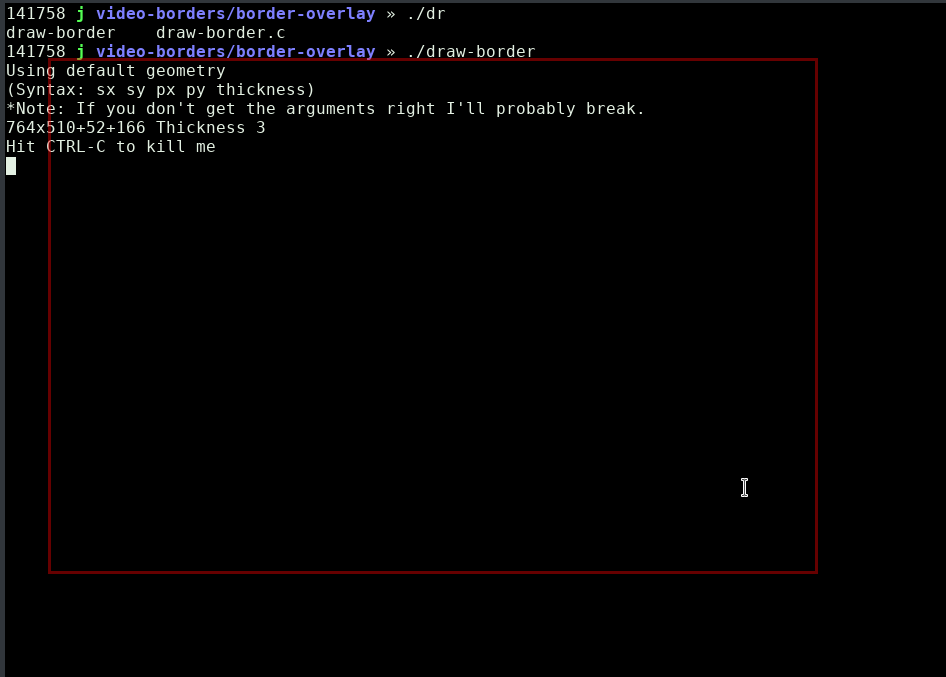

# border-overlay
Draws a box on the screen which won't catch mouse events.
(This also demonstrates doing a screen overlay... that won't gobble your mouse clicks so they pass through to the underlying window).



# Compiling
1. Type make

# Usage:

```
./draw-border sizex sizey posx posy thickness
```
# Running
1. (Hit CTRL-C to quit)
1. Try: ./draw-border
2. ...or: ./draw-border 300 200 400 100 10
